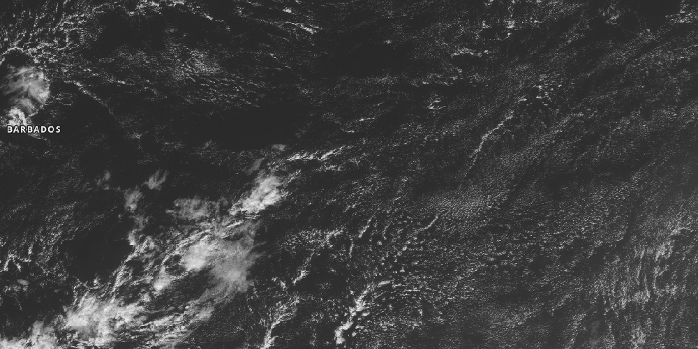

# Download tool for NASA WorldView



[](https://travis-ci.com/leifdenby/worldview_dl)

## Installation

```bash
> pip install worldview_dl
```

## Usage

You may either download using the command line cli:

```bash
usage: cli.py [-h] [--layers LAYERS [LAYERS ...]] [--image_type IMAGE_TYPE]
              [--resolution RESOLUTION] [--end-time END_TIME]
              time bbox
```

for example

```bash
> python -m worldview_dl.cli "2020-01-28 16:20" 10.,-60.,15.,-50. --image_type png
```

Or with the python package

```python
from worldview_dl import download_image
import datetime
import pytz

t_now = datetime.datetime.now().replace(tzinfo=pytz.utc)
t = t_now - datetime.timedelta(hours=2)

download_image(
    fn="GOES_test.png",
    time=t,
    bbox=[10.,-60.,15.,-50.],
    layers=['GOES-East_ABI_Band2_Red_Visible_1km', 'Reference_Labels'],
    image_format="png",
    resolution=0.01,
)
```
